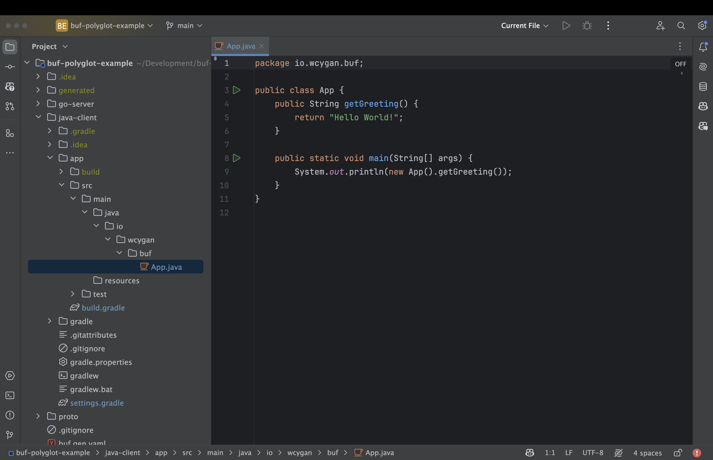
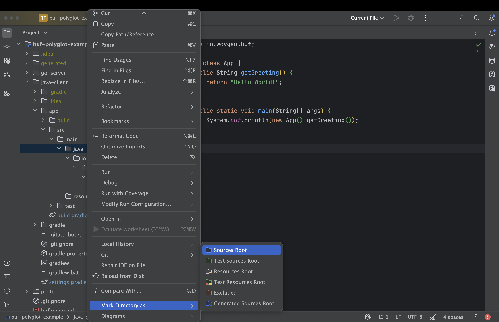
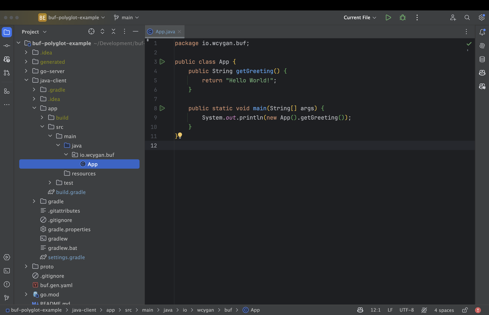

# buf-polyglot-example

This is an example of how to use [buf](https://buf.build/) in a multi-language repository.

## Generate stubs from protobuf schemas

Run the following command:

```bash
$ buf generate proto
```

## Start the server

Run the following command:

```bash
go run go-server/main.go
```

## Testing with grpcurl

You can use [grpcurl](https://github.com/fullstorydev/grpcurl) to test the server:

#### Request

```bash
grpcurl -plaintext -proto schemas/proto/hello/v1/hello.proto -d '{"name": "YourName"}' localhost:50051 hello.v1.HelloService/SayHello
```

#### Response 

```json
{
  "message": "Hello YourName"
}
```

## How did I get the [buf.yaml](proto/buf.yaml) file?

I ran the following command in the [proto](proto) directory:

```bash
$ buf mod init
```

## How did I get the [buf.gen.yaml](buf.gen.yaml) file?

I created it, then I added package names as well as plugins for the languages which I wanted to generate protobuf and
grpc stubs for.

## How did I get IntelliJ to index the Java Subproject?

I open the *root directory* of this project in IntelliJ and use the Go plugin. However, IntelliJ doesn't necessarily index the subprojects properly.


| Before                                        | During                                 | After                                        |
|-----------------------------------------------|----------------------------------------|----------------------------------------------|
|  |  |  |